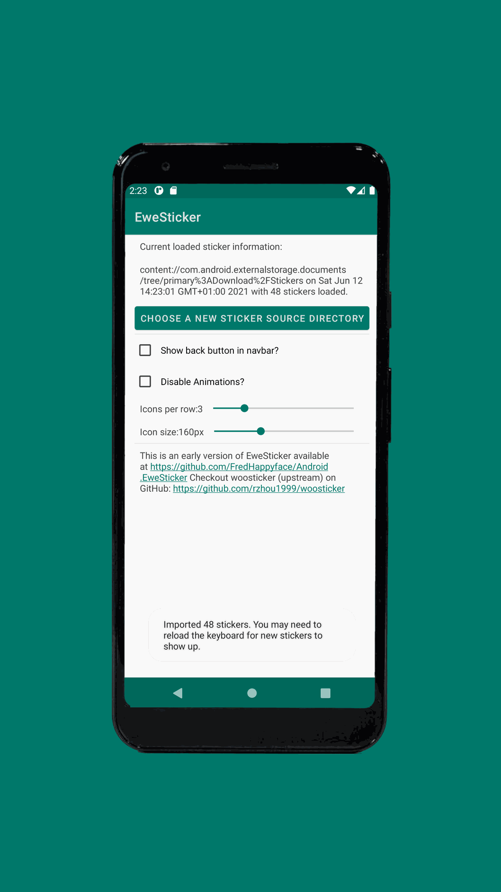
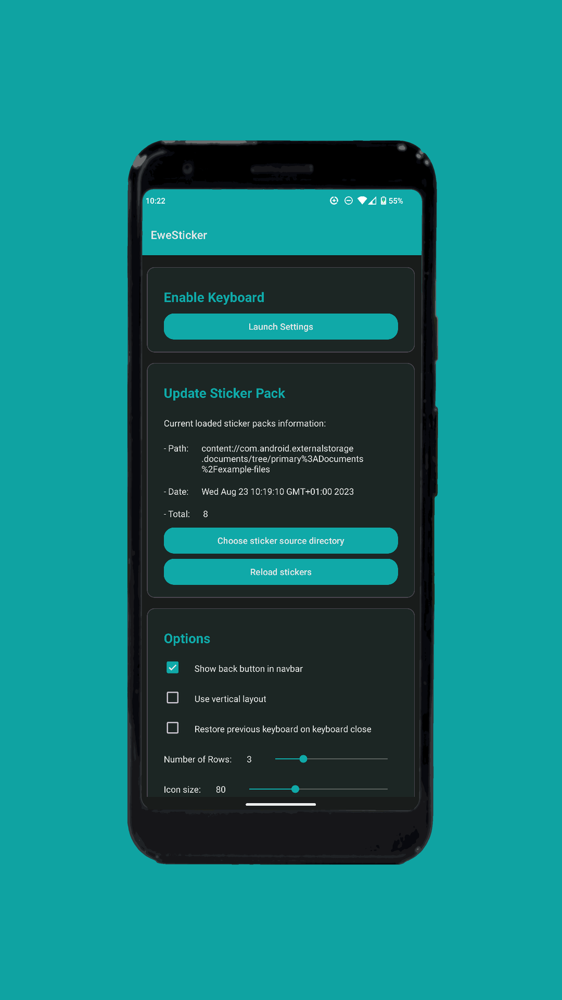
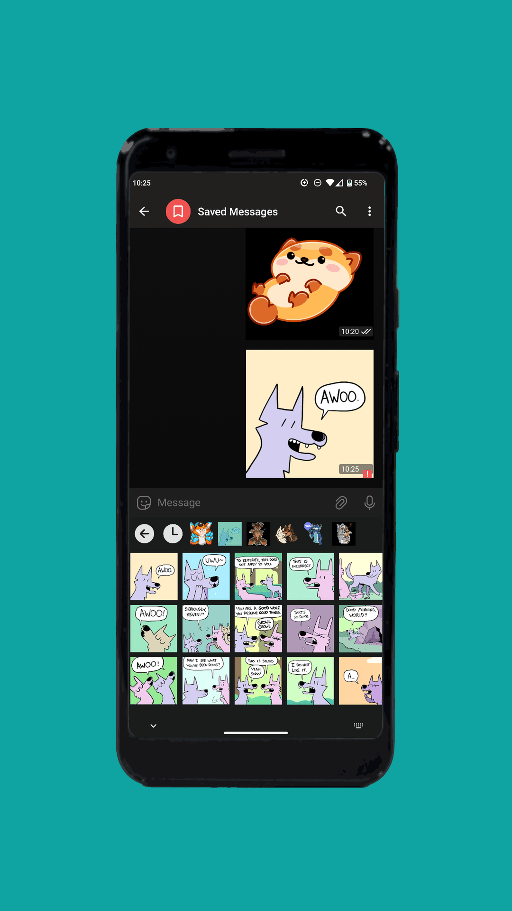
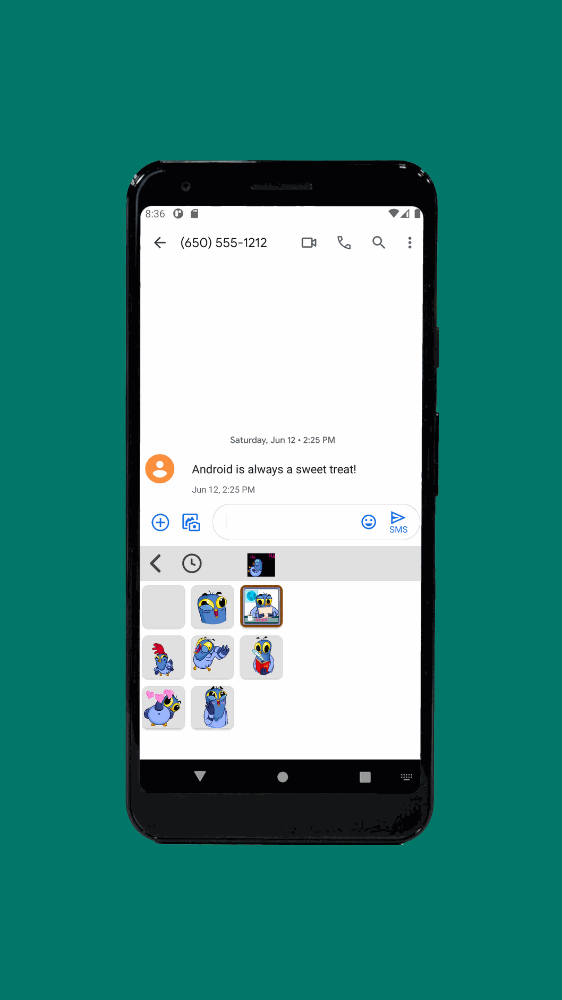
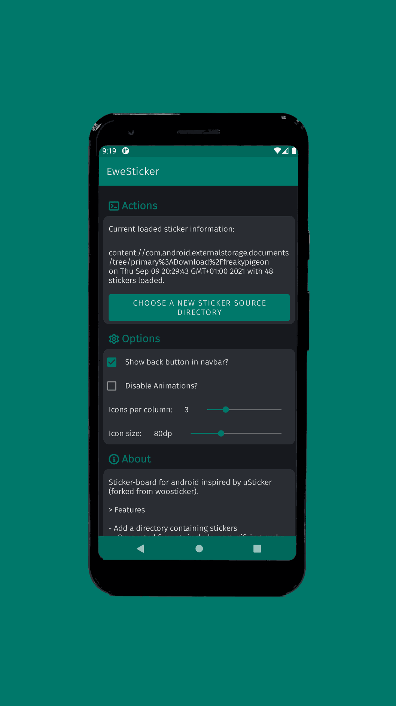
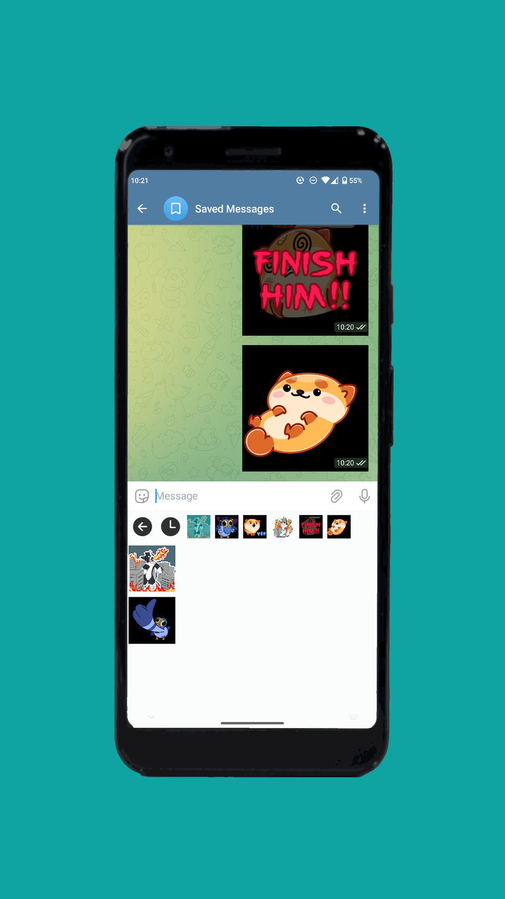

[](../../)
[](../../)
[](../../issues)
[](/LICENSE.md)
[](../../commits/master)
[](../../commits/master)
[](../../releases)

<!-- omit in toc -->
# Android.EweSticker


Sticker-board for android inspired by uSticker (forked from woosticker).

- [Features](#features)
- [Screenshots](#screenshots)
- [How to use](#how-to-use)
- [Lint with](#lint-with)
- [Language Information](#language-information)
	- [Kotlin and Android Version](#kotlin-and-android-version)
		- [Download Android Studio](#download-android-studio)
- [How to Run](#how-to-run)
	- [Build From Source](#build-from-source)
	- [Get it on F-Droid](#get-it-on-f-droid)
	- [Get it on Google Play](#get-it-on-google-play)
	- [Download the APK](#download-the-apk)
- [Download Project](#download-project)
	- [Clone](#clone)
		- [Using The Command Line](#using-the-command-line)
		- [Using GitHub Desktop](#using-github-desktop)
	- [Download Zip File](#download-zip-file)
- [Community Files](#community-files)
	- [Licence](#licence)
	- [Changelog](#changelog)
	- [Code of Conduct](#code-of-conduct)
	- [Contributing](#contributing)
	- [Security](#security)
	- [Support](#support)
	- [Rationale](#rationale)

## Features

- Wide range of custom stickers supported
	- Formats include image/gif (.gif), image/png (.png), image/webp
	(.webp), image/jpg (.jpg, .jpeg, .jpe, ...), image/heif (.heif, .heifs, .heic, ...)
- Send stickers in supported apps (.png is used as a fallback)
- Vertical and Horizontal scrolling
- Change number of rows and sticker preview size
- Ties in with the system theme

## Screenshots

<p>






</p>

## How to use
See the [Tutorial](/TUTORIAL.md) for more information.

## Lint with

```txt
java -jar .\ktlint --experimental --android --disabled_rules='indent,parameter-list-wrapping,experimental:argument-list-wrapping'
```

## Language Information

### Kotlin and Android Version
This app has been written in Kotlin 1.5.0 with the Android Studio IDE.

- The target SDK version is 30 (Android 11)
- The minimum SDK version is 28 (Android 9 Pie)

#### Download Android Studio
Download the Android Studio IDE from <https://developer.android.com/studio/>.
For Windows, double click the downloaded .exe file and follow the instructions
provided by the installer - it will download the Android emulator and the
Android SDK. Additional information can be found at
<https://developer.android.com/studio/install>

## How to Run

### Build From Source

1. Download or clone this GitHub repository
2. (If downloaded) Extract the zip archive
3. In Android Studio click File > Open and then navigate to the project file
(Android studio defaults to the directory of the last opened file)

### Get it on F-Droid

1. Open the F-Droid app
2. Search for EweSticker

**Or**

[](https://f-droid.org/en/packages/com.fredhappyface.ewesticker/)

Follow the link to the listing on F-Droid by clicking on the badge above,
then download/ install

### Get it on Google Play

1. Open the Google Play app
2. Search for EweSticker

**Or**

[](https://play.google.com/store/apps/details?id=com.fredhappyface.ewesticker)

Follow the link to the listing on Google Play by clicking on the badge above,
then download/ install

### Download the APK

1. For releases, navigate to the /app/release directory. For debug, navigate to /app/debug
2. Select the debug or release APK depending on your preference. Note that the
filenames are in the form: app-(debug/release)_(version)_yyyy-mm-dd.apk (I would recommend
downloading the most recent release APK)

**Or**

[](/app/release)

Follow the link to the /app/release directory by clicking on the badge above, then
select the preferred version.

## Download Project

### Clone

#### Using The Command Line

1. Press the Clone or download button in the top right
2. Copy the URL (link)
3. Open the command line and change directory to where you wish to
clone to
4. Type 'git clone' followed by URL in step 2

	```bash
	git clone https://github.com/FredHappyface/BlendModes
	```

More information can be found at
https://help.github.com/en/articles/cloning-a-repository

#### Using GitHub Desktop

1. Press the Clone or download button in the top right
2. Click open in desktop
3. Choose the path for where you want and click Clone

More information can be found at
https://help.github.com/en/desktop/contributing-to-projects/cloning-a-repository-from-github-to-github-desktop

### Download Zip File

1. Download this GitHub repository
2. Extract the zip archive
3. Copy/ move to the desired location

## Community Files

### Licence
MIT License
(See the [LICENSE](/LICENSE.md) for more information.)

### Changelog
See the [Changelog](/CHANGELOG.md) for more information.

### Code of Conduct
Online communities include people from many backgrounds. The *Project*
contributors are committed to providing a friendly, safe and welcoming
environment for all. Please see the
[Code of Conduct](https://github.com/FredHappyface/.github/blob/master/CODE_OF_CONDUCT.md)
 for more information.

### Contributing
Contributions are welcome, please see the
[Contributing Guidelines](https://github.com/FredHappyface/.github/blob/master/CONTRIBUTING.md)
for more information.

### Security
Thank you for improving the security of the project, please see the
[Security Policy](https://github.com/FredHappyface/.github/blob/master/SECURITY.md)
for more information.

### Support
Thank you for using this project, I hope it is of use to you. Please be aware that
those involved with the project often do so for fun along with other commitments
(such as work, family, etc). Please see the
[Support Policy](https://github.com/FredHappyface/.github/blob/master/SUPPORT.md)
for more information.

### Rationale
The rationale acts as a guide to various processes regarding projects such as
the versioning scheme and the programming styles used. Please see the
[Rationale](https://github.com/FredHappyface/.github/blob/master/RATIONALE.md)
for more information.
