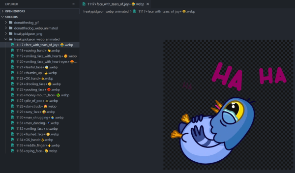
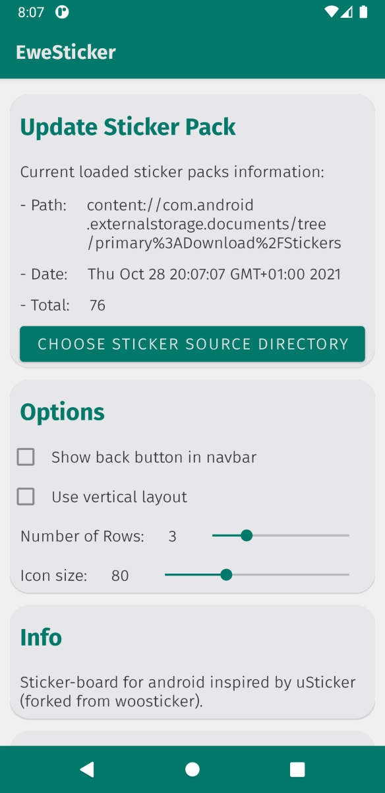
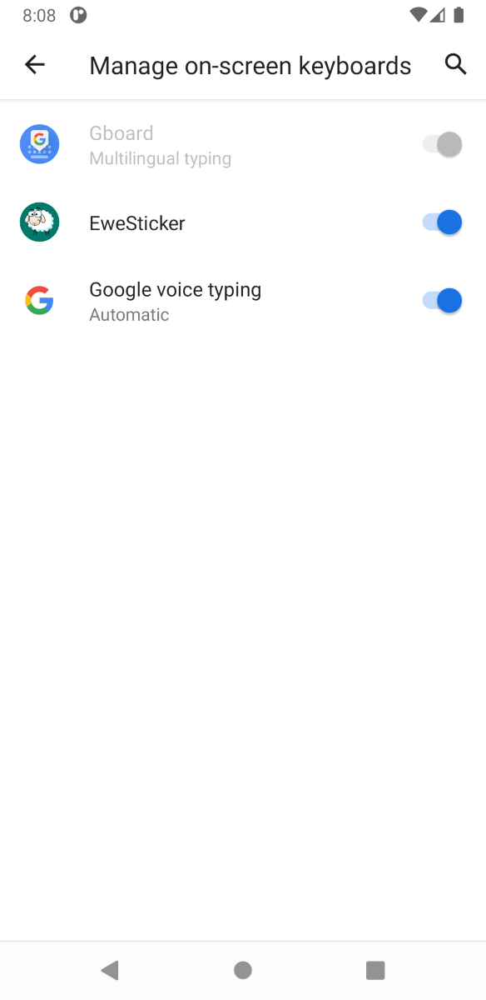
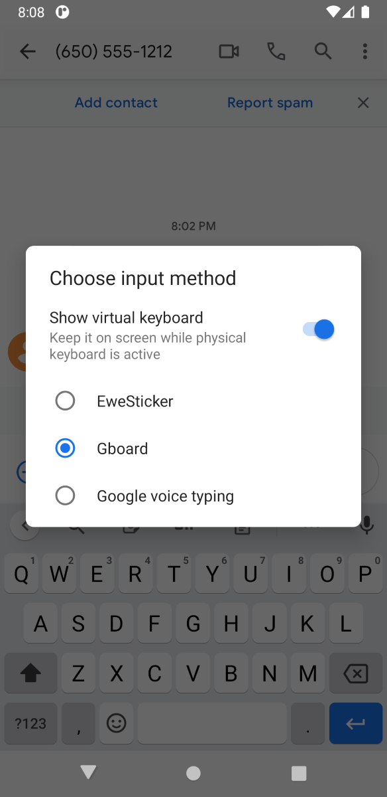
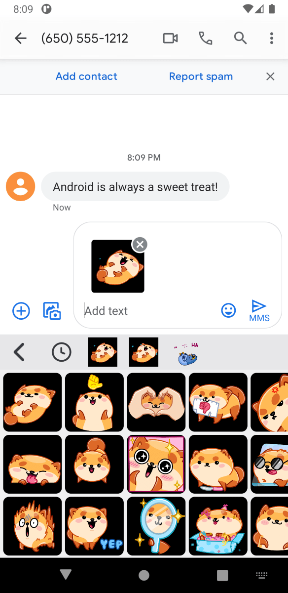

# Tutorial

See below for a step-by-step tutorial on how to use EweSticker with your existing
sticker collection.


## Step 1 - Create Sticker Directory (and transfer to device)



The sticker directory has the following structure:

```none
/root
     /sticker-pack-name-1
                         /sticker-1
						 /sticker-2
     /sticker-pack-name-2
                         /sticker-1
						 /sticker-2
```

Then transfer this to your phone/ device. Plugging this into a PC is a pretty
convenient way to do this.

## Step 2 - Download EweSticker

The current option is to Download the APK, however, I plan to make this available
on Google Play + F-droid.


### Download the APK
1. For releases, navigate to the /app/release directory. For debug, navigate to /app/debug
2. Select the debug or release APK depending on your preference. Note that the
filenames are in the form: app-(debug/release)_(version)_yyyy-mm-dd.apk (I would recommend
downloading the most recent release APK)

**Or**

[](/app/release)

Follow the link to the /app/release directory by clicking on the badge above, then
select the preferred version.

## Step 3 - Select Directory with EweSticker (and wait...)


1. Click the "CHOOSE A NEW STICKER SOURCE DIRECTORY" button

	

2. Select the sticker directory created in step 1

	


## Step 4 - Activate the keyboard

- Search 'keyboard' in settings and select 'On-screen keyboard', then '+ Manage
	on-screen keyboards' and toggle EweSticker on.

	


## Step 5 - Send Stickers in your favourite apps

1. Tap the keyboard switcher icon and select EweSticker

	


2. Find and send a sticker of your choosing

	
