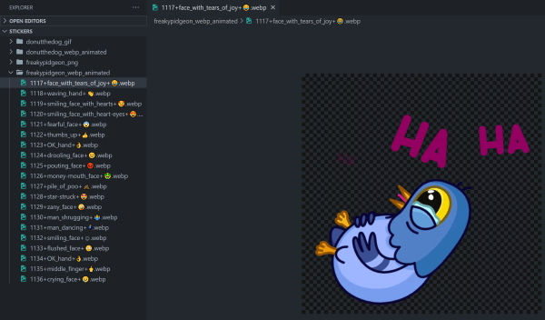
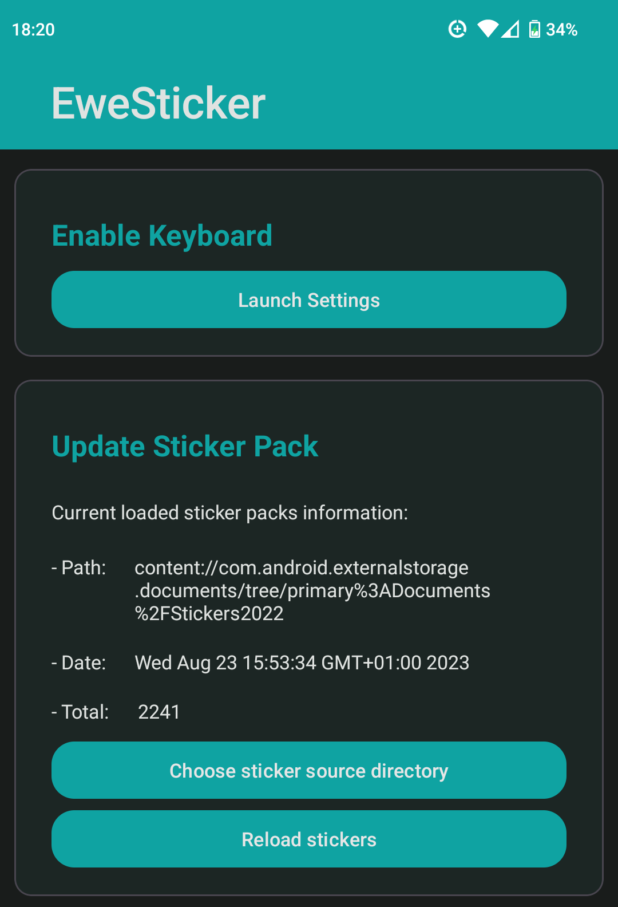
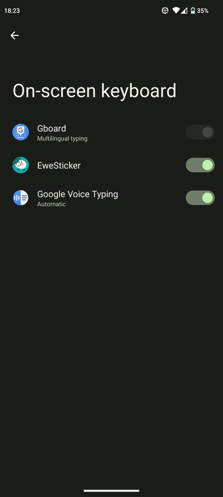
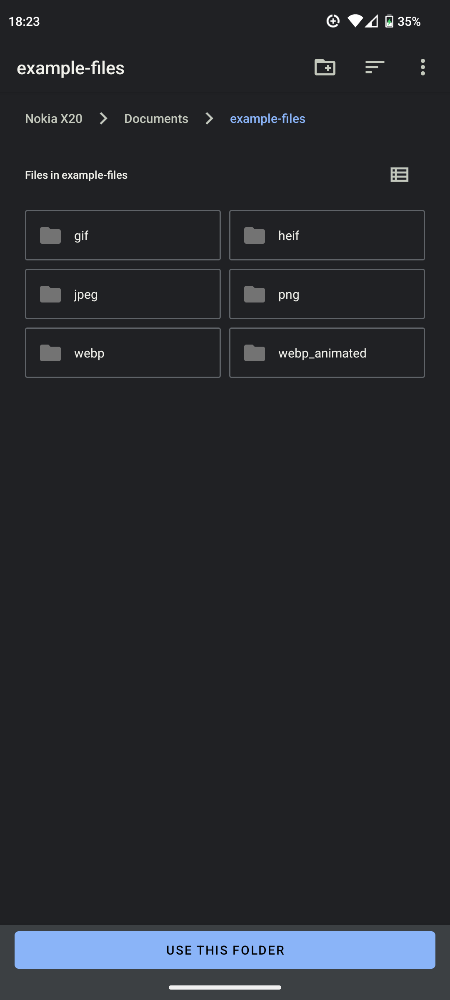
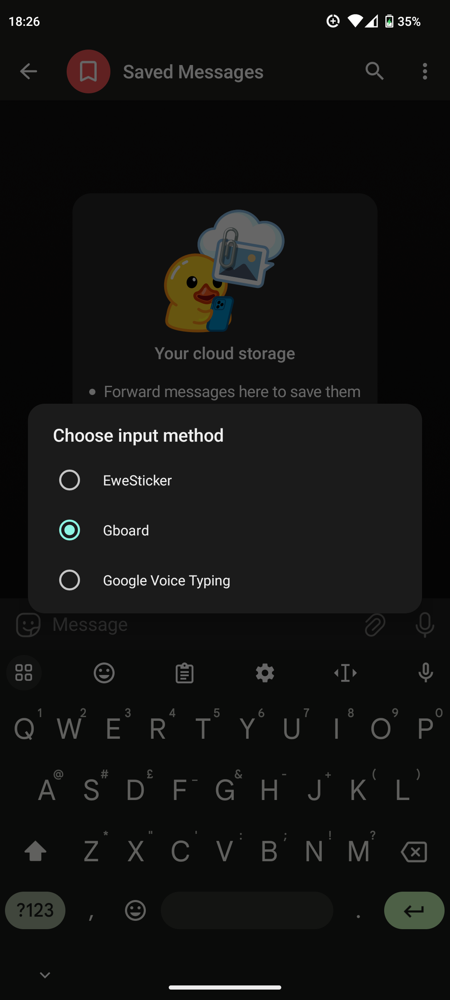
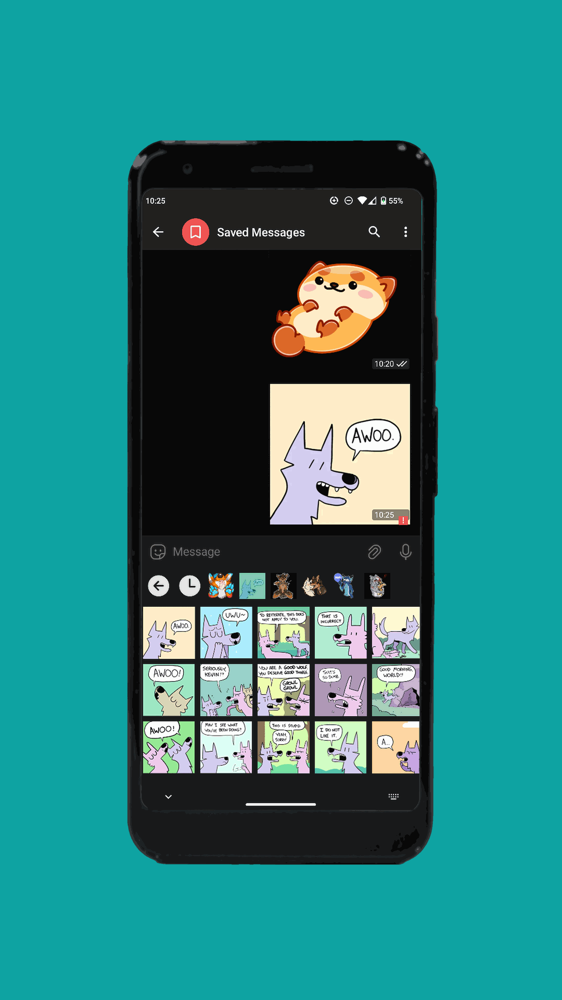
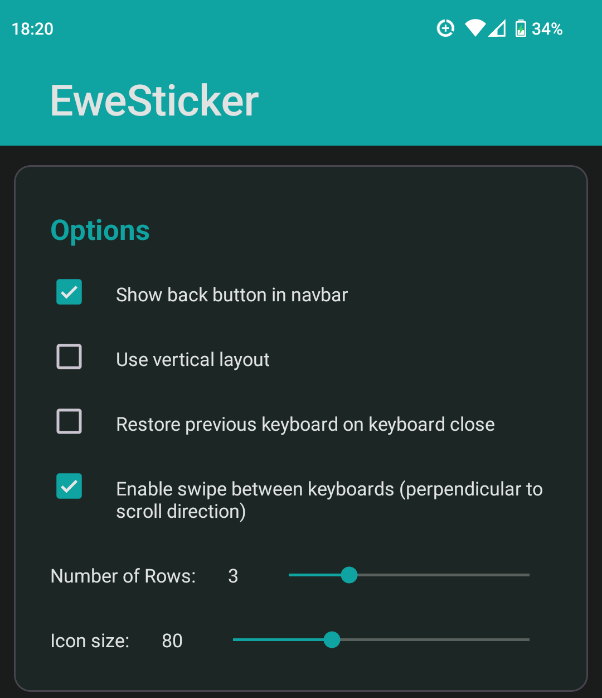
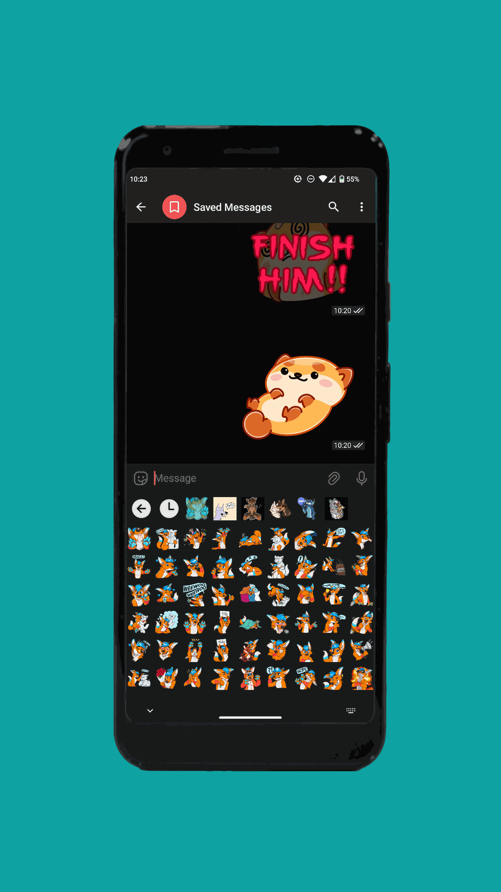

<!-- omit in toc -->
# Tutorial

See below for a step-by-step tutorial on how to use EweSticker with your existing
sticker collection.

- [Step 1 - Create Sticker Directory (and transfer to device)](#step-1---create-sticker-directory-and-transfer-to-device)
- [Step 2 - Download EweSticker](#step-2---download-ewesticker)
- [Step 3 - Activate the keyboard](#step-3---activate-the-keyboard)
- [Step 4 - Select Directory with EweSticker](#step-4---select-directory-with-ewesticker)
- [Step 5 - Send Stickers in your favourite apps](#step-5---send-stickers-in-your-favourite-apps)

## Step 1 - Create Sticker Directory (and transfer to device)



The sticker directory has the following structure:

```none
/root
     /sticker-pack-name-1
                         /sticker-1
                         /sticker-2
     /sticker-pack-name-2
                         /sticker-1
                         /sticker-2
```

Then transfer this to your phone/ device. Plugging this into a PC is a pretty
convenient way to do this.

**NOTE:** that the maximum pack size is currently **128** and the total maximum number of stickers supported
is **4096**

## Step 2 - Download EweSticker

You can install the app using the following methods, Follow the link to the listing on your
preferred store by clicking on one of the badges below, then download/install:

[](https://f-droid.org/en/packages/com.fredhappyface.ewesticker/)
[](https://play.google.com/store/apps/details?id=com.fredhappyface.ewesticker)
[](../../releases)

## Step 3 - Activate the keyboard

Click the `Launch Settings` button



Toggle EweSticker on



## Step 4 - Select Directory with EweSticker

Click the `Choose sticker source directory` button


Select the sticker directory created in step 1



## Step 5 - Send Stickers in your favourite apps

Tap the keyboard switcher icon and select EweSticker



Find and send a sticker of your choosing



**Note:** That you can configure EweSticker to:

- enable/disable the back button
- use the vertical scroll layout
- restore the previous keyboard when the keyboard is closed (through tapping away from a text input)
- enable swipe between sticker packs (perpendicular to scroll direction, i.e. vertical swipe if not using the vertical layout)
- number of rows (between 2 and 6)
- icon size if not in vertical scroll layout




