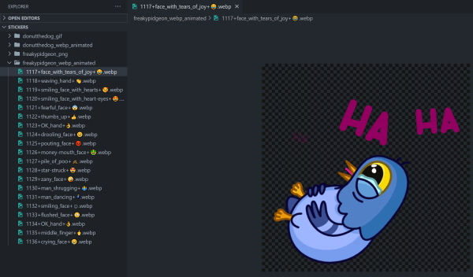
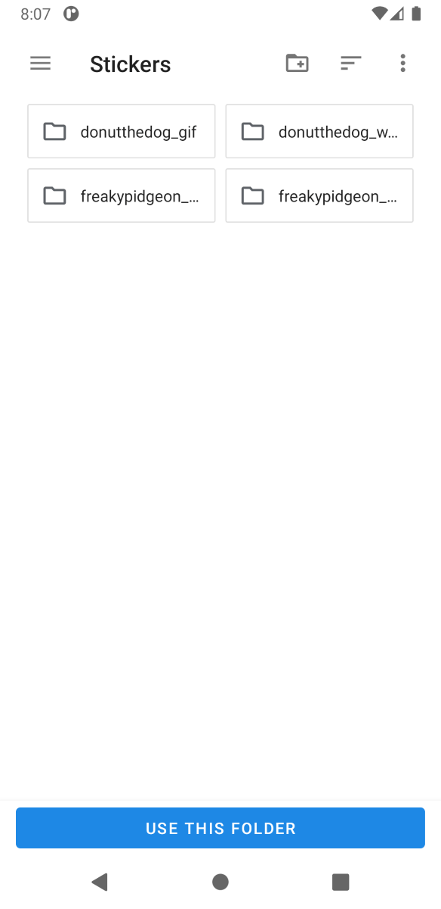
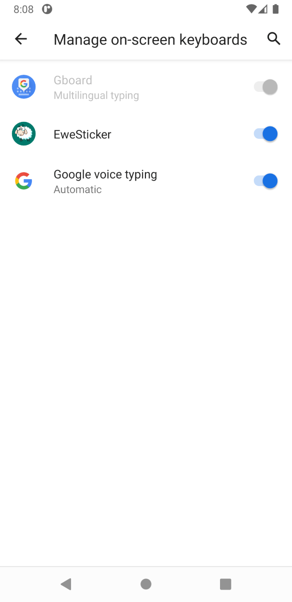
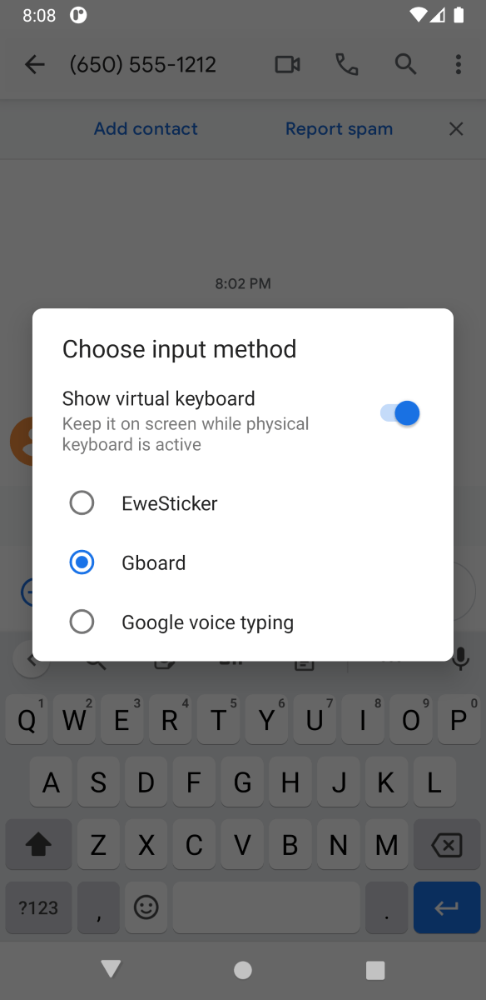
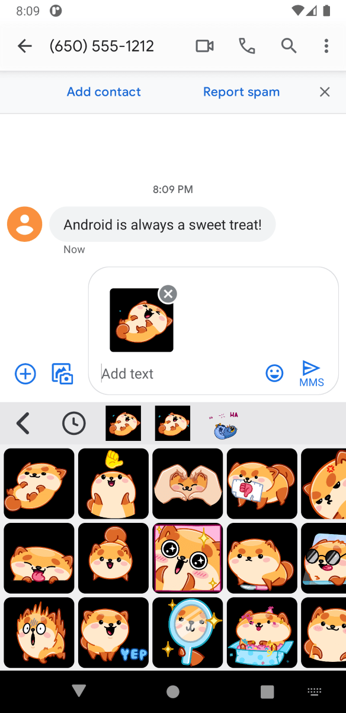

<!-- omit in toc -->
# Tutorial

See below for a step-by-step tutorial on how to use EweSticker with your existing
sticker collection.

- [Step 1 - Create Sticker Directory (and transfer to device)](#step-1---create-sticker-directory-and-transfer-to-device)
- [Step 2 - Download EweSticker](#step-2---download-ewesticker)
	- [Get it on F-Droid](#get-it-on-f-droid)
	- [Get it on Google Play](#get-it-on-google-play)
	- [Download the APK](#download-the-apk)
- [Step 3 - Select Directory with EweSticker (and wait...)](#step-3---select-directory-with-ewesticker-and-wait)
- [Step 4 - Activate the keyboard](#step-4---activate-the-keyboard)
- [Step 5 - Send Stickers in your favourite apps](#step-5---send-stickers-in-your-favourite-apps)

## Step 1 - Create Sticker Directory (and transfer to device)



The sticker directory has the following structure:

```none
/root
     /sticker-pack-name-1
                         /sticker-1
                         /sticker-2
     /sticker-pack-name-2
                         /sticker-1
                         /sticker-2
```

Then transfer this to your phone/ device. Plugging this into a PC is a pretty
convenient way to do this.

**NOTE:** that the maximum pack size is currently **128** and the total maximum number of stickers supported
is **4096**

## Step 2 - Download EweSticker

### Get it on F-Droid

1. Open the F-Droid app
2. Search for EweSticker

**Or**

[](https://f-droid.org/en/packages/com.fredhappyface.ewesticker/)

Follow the link to the listing on F-Droid by clicking on the badge above,
then download/ install

### Get it on Google Play

1. Open the Google Play app
2. Search for EweSticker

**Or**

[](https://play.google.com/store/apps/details?id=com.fredhappyface.ewesticker)

Follow the link to the listing on Google Play by clicking on the badge above,
then download/ install

### Download the APK

1. For releases, navigate to the releases page [here](../../releases).
2. Select the debug or release APK depending on your preference. Note that the
filenames are in the form: com.fredhappyface.ewesticker-(version)-(debug|release).apk

**Or**

[](../../releases)

Navigate to the releases page by clicking on the badge above.

## Step 3 - Select Directory with EweSticker (and wait...)

1. Click the "CHOOSE STICKER SOURCE DIRECTORY" button

	

2. Select the sticker directory created in step 1

	

## Step 4 - Activate the keyboard

- Search 'keyboard' in settings and select 'On-screen keyboard', then '+ Manage
	on-screen keyboards' and toggle EweSticker on.

	

## Step 5 - Send Stickers in your favourite apps

1. Tap the keyboard switcher icon and select EweSticker

	

2. Find and send a sticker of your choosing

	
